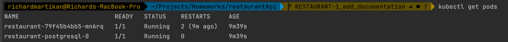
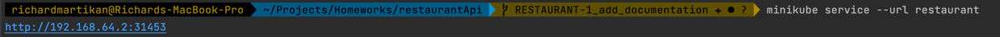
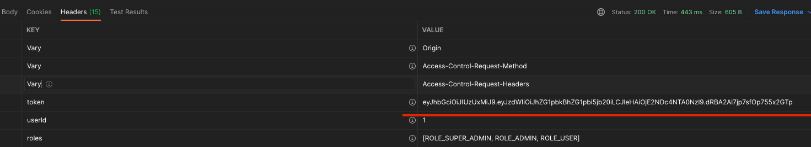
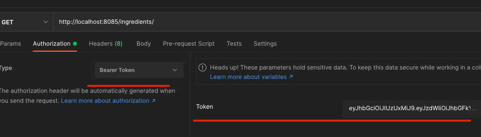
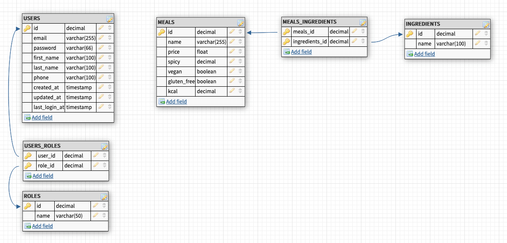

# Restaurant API
Simple CRUD API with authentication and minimalistic functionality.
<br>It uses Continuous Integration and Continuous Delivery (CI/CD).
* Run Build & Test at every git push
* Run Build & Test and deploy a Docker image(dev) at every Pull Request.
* Run Build & Test and deploy it to Docker hub at Releases.

### Run in development mode
When you clone the source code, you can simply run the service in development mode if you
set up the active profile to `dev`. In development mode doesn't necessary any database because
it uses H2 db in memory.

### Run in production mode
In production mode you must configure the environment variables and a running PostgreSQL database
instance is mandatory.

### How to deploy with docker
The API is available on Docker hub. So it's pretty easy.
Here is a sample docker-compose.yml code for it:
```yml
version: "3.7"

# Define services
services:
  # Backend service
  api-server:
    container_name: restaurant_api
    image: martikan/restaurant-api:dev-2022-03-11
    ports:
      - 8085:8085 # Forward the exposed port 8085 on the container to port 8085 on the host machine
    restart: on-failure
    depends_on:
      - db # This service depends on PostgreSQL db. Start that first.
    environment: # Pass environment variables to the service
      DATASOURCE_URL: jdbc:postgresql://postgres:5432/postgres
      DATASOURCE_USER: postgres
      DATASOURCE_PASSWORD: aaa
      TOKEN_EXPIRATION: 600000
      TOKEN_SECRET: Aso1940129##@=@!
      PORT: 8085

    networks: # Networks to join (Services on the same network can communicate with each other using their name)
      - backend

  # Database Service (PostgreSQL)
  db:
    container_name: postgres
    image: postgres
    environment:
      POSTGRES_USER: postgres
      POSTGRES_PASSWORD: aaa
      PGDATA: /data/postgres
    volumes:
       - postgres:/data/postgres
    ports:
      - "5432:5432"
    networks:
      - backend
    restart: unless-stopped

# Volumes
volumes:
  postgres:

# Networks to be created to facilitate communication between containers
networks:
  backend:
```

### How to deploy to kubernetes
* (I use minikube for local environment) ex: `minikube start --driver=hyperkit --container-runtime=docker`
* The helm chart is included with the project, so you can run this command in the project root: `helm install restaurant ./helm-chart`
* You can verify is it successfully installed if you run `kubectl get pods`

* You can check the correct ip address with `minikube service --url restaurant`


### Sample calls

* You can sign-in with Admin as well:
  * email: `admin@admin.com`
  * password: `aaa1234`
* Or sign-up a new User (With User role... it cannot create new meals, etc. only fetch them)
* After sign-in, set up the correct token for Authorization header:




| URI                               | HTTP Action | Headers                                           | Description                                                              | Payload                                                                                                                                                                 |
|-----------------------------------|-------------|---------------------------------------------------|--------------------------------------------------------------------------|-------------------------------------------------------------------------------------------------------------------------------------------------------------------------|
| /auth/signUp                      | POST        | Content-Type: "application/json"                  | Register a user                                                          | `{"email": "aladar@gmail.com","password": "Alma1234","firstName": "Aladar","lastName": "Mezga","phoneNumber": "06303332266"}`                                           |
| /auth/signIn                      | POST        | Content-Type: "application/x-www-form-urlencoded" | Login with a User<br><br>The JWT token will be returned in the `HEADERS` | `{"email": "aladar@gmail.com","password": "aaa1234"}`                                                                                                                   |
| /ingredients/                     | GET         | Content-Type: "application/json"                  | Get all ingredients                                                      |                                                                                                                                                                         |
| /ingredients/{id}                 | GET         | Content-Type: "application/json"                  | Get ingredient by id                                                     |                                                                                                                                                                         |
| /ingredients/{id}                 | PUT         | Content-Type: "application/json"                  | Update ingredient                                                        | `{"name": "something ingredient name"}`                                                                                                                                 |
| /ingredients/                     | POST        | Content-Type: "application/json"                  | Save ingredient                                                          | `{"name": "something ingredient name"}`                                                                                                                                 |
| /ingredients/{id}                 | DELETE      |                                                   | Delete ingredient by id                                                  |                                                                                                                                                                         |
| /meals/?sort=name&page=0&size=20  | GET         | Content-Type: "application/json"                  | Get all meals using pagination and sorting                               |                                                                                                                                                                         |
| /meals/{id}                       | GET         | Content-Type: "application/json"                  | Get meal by id                                                           |                                                                                                                                                                         |
| /meals/{id}                       | PUT         | Content-Type: "application/json"                  | Update meal                                                              | `{"name": "Someting meal's name","price": 1.00,"spicy": 3,"kcal": 100,"ingredients": [{"id": 1,"name": "tomato"},{"id": 2,"name": "pork"},{"id": 6,"name": "onion"}]}`  |
| /meals/                           | POST        | Content-Type: "application/json"                  | Save meal                                                                | `{"name": "Someting meal's name","price": 1.00,"spicy": 3,"kcal": 100,"ingredients": [{"id": 1,"name": "tomato"},{"id": 2,"name": "pork"},{"id": 6,"name": "onion"}]}`  |
| /meals/{id}                       | DELETE      |                                                   | Delete meal by id                                                        |                                                                                                                                                                         |

### Database design
